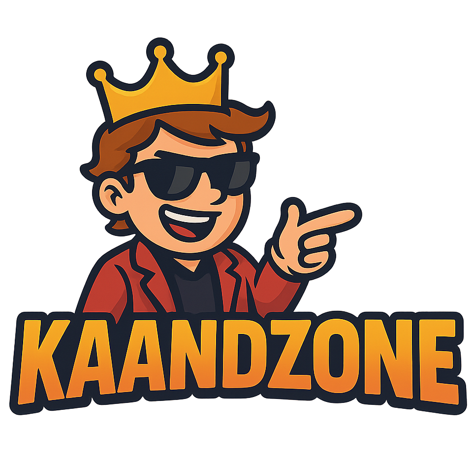

# KaandZone

**KaandZone** is a web-based platform for playing social deduction and party games online with friends. It features games like Raja Rani Chor Police, Night Mafia, Guess the Character, and Answer the Question.

## Features

- User and Admin login
- Create and join game rooms
- Multiple game types with unique rules
- Responsive, modern UI with dark theme
- Built with React, TypeScript, Firebase, and React Router

## Project Structure

```
src/
  assets/           # Static assets (logo, images)
  components/       # Reusable React components
  configuration/    # Firebase configuration
  pages/            # Page-level React components
  styles/           # CSS files
  types/            # TypeScript types
  App.tsx           # Main app component
  main.tsx          # Entry point
```

## Getting Started

### Prerequisites

- Node.js (v18+ recommended)
- npm or yarn

### Setup

1. **Clone the repository:**
   ```sh
   git clone https://github.com/Sankalp-Dawada/KaandZone.git
   cd kaandzone
   ```

2. **Install dependencies:**
   ```sh
   npm install
   # or
   yarn install
   ```

3. **Configure Firebase:**
   - Update `src/configuration/firebase.ts` with your Firebase project credentials.

4. **Run the development server:**
   ```sh
   npm run dev
   # or
   yarn dev
   ```

5. **Open in your browser:**
   ```
   http://localhost:5173
   ```

## Scripts

- `npm run dev` — Start the development server
- `npm run build` — Build for production
- `npm run preview` — Preview the production build

## Technologies Used

- [React](https://react.dev/)
- [TypeScript](https://www.typescriptlang.org/)
- [Firebase](https://firebase.google.com/)
- [React Router](https://reactrouter.com/)
- [Vite](https://vitejs.dev/)

## TODO

<div style="background:#181818; padding: 16px; border-radius: 8px; color: #fff;">
  <label style="display:block; margin-bottom:8px;">
    <input type="checkbox" style="accent-color:#222; width:18px; height:18px;"> Integrate Gemini API for choosing a random player
  </label>
  <label style="display:block; margin-bottom:8px;">
    <input type="checkbox" style="accent-color:#222; width:18px; height:18px;"> Show available rooms on the homepage
  </label>
  <label style="display:block; margin-bottom:8px;">
    <input type="checkbox" style="accent-color:#222; width:18px; height:18px;"> Add special features accessible only to admins
  </label>
  <label style="display:block; margin-bottom:8px;">
    <input type="checkbox" style="accent-color:#222; width:18px; height:18px;"> Add a leaderboard for players
  </label>
  <label style="display:block; margin-bottom:8px;">
    <input type="checkbox" style="accent-color:#222; width:18px; height:18px;"> Enhance room creation and management features
  </label>
  <label style="display:block; margin-bottom:8px;">
    <input type="checkbox" style="accent-color:#222; width:18px; height:18px;"> Host the site using Netlify
  </label>
</div>

## License

This project is for educational and personal use.

---

Enjoy playing with your friends on **KaandZone**!